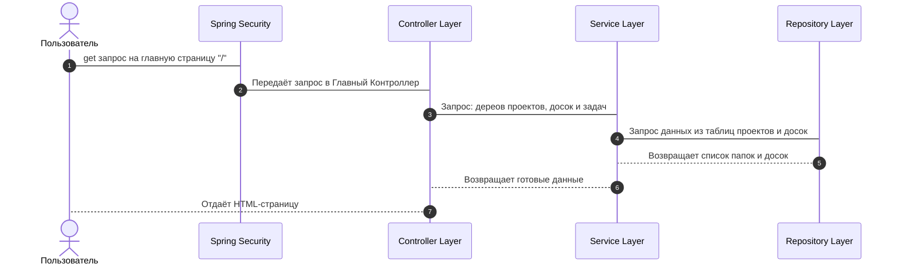

# О приложении

Учебный проект предсталвяет собой систему управления задачи для совместной работы на основе канбан-досок. Приложение включает в себя возможность глубокого структурированного хранения проектов и текущих задач.

# Ход работы

1. Основы
    * [ ] Скелет сайта
    * [ ] Разработка логической и реляционной базы данных
    * [ ] Отображении данных на сайте
2. Spring Security
    * [ ] Аутентификация пользователя
    * [ ] Управление доступом (ограничение функционала или содержимого для определенных ролей)
    * [ ] Регистрация пользователя
    * [ ] (optional) Управление ролями и привилегиями

# Функциональные требования

1. Регистрация и аутентификация пользователей, управление доступом и ролями к содержимому системы
2. Разделение и организация данных на основе проектов
3. Управление задачами, их создание внутри досок и расширенная персонализация, включая возможность текстового описания с использвованием разметки Markdown

# Нефункциональные требования

1. Быстрая обработка действия пользователя
2. Безопасность данных

