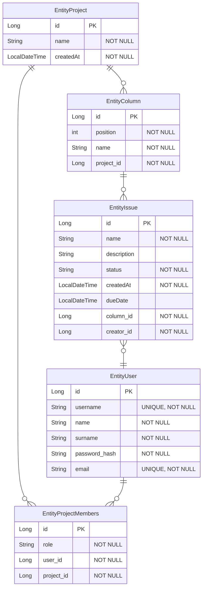

# О приложении

Учебный проект предсталвяет собой систему управления задачи для совместной работы на основе канбан-досок. Приложение включает в себя возможность глубокого структурированного хранения проектов и текущих задач.

# Функциональные требования

1. Безопасность и доступ
   * [ ] Аутентификация пользователей
   * [ ] Регистрация пользователей
2. База данных
   * [x] Создание логической базы данных
   * [x] Реализация базы данных через JPA
   * [x] Инициализация базы данных через файл data.sql
4. Работа с проектами
   * [x] Создание скелета сайта
   * [x] Просмотр списка проектов
   * [x] Просмотр списка досок
   * [x] Просмотр списка задач
   * [ ] Drag-and-drop механизм для задач
5. Управление задачами
   * [x] Создание проектов
   * [ ] Создание досок
   * [ ] Создание задач
   * [ ] Редактирование проектов
   * [ ] Редактирование досок
   * [ ] Редактирование задач

# Нефункциональные требования

1. Java 26. HTMX, Thymeleaf, Tailwind, Lombok, Hibernate
2. Spring Framework, Spring Boot, Spring Security
3. H2 БД

