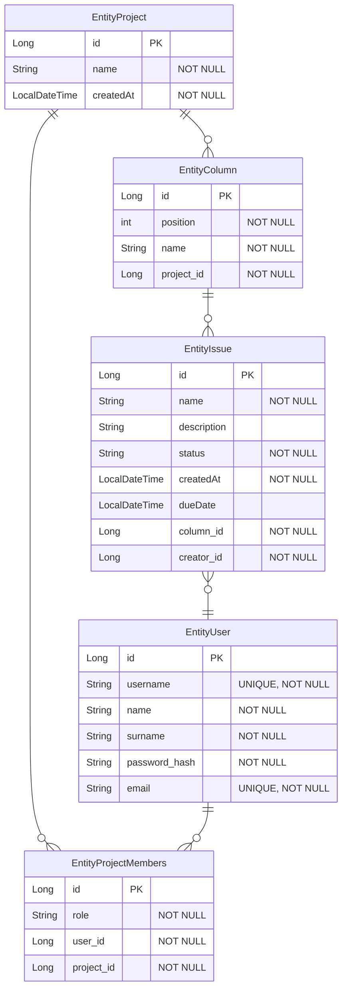

# О приложении

Учебный проект предоставляет собой систему управления задачи для совместной работы на основе канбан-досок. Приложение включает в себя возможность глубокого структурированного хранения проектов и текущих задач.

# Функциональные требования

1. Безопасность и доступ
   - Регистрация нового пользователя
   - Вход в систему
   - Выход из учётной записи
   - Доступ к проектам только для аутентифицированных пользователей
2. Управление проектами
   - Создание нового проекта
   - Просмотр списка своих проектов
   - Редактирование и удаление проекта
   - Генерация уникального кода приглашения при создании проекта
4. Участники проекта
   - Просмотр списка участников проекта
   - Присоединение к проекту по коду приглашения
5. Управление задачами
  - Создание колонок и задач
  - Отображение колонок с задачами
  - Создание задачи в колонке
  - Просмотр и редактирование задачи в модальном окне
  - Удаление задачи
  - Обновление счётчика общего количества задач в проекте

# Нефункциональные требования

1. Java 26, Thymeleaf, Tailwind, Lombok, Hibernate, HTMX для динамической подгрузки
2. Spring Framework, Spring Boot, Spring Security
3. H2 БД

